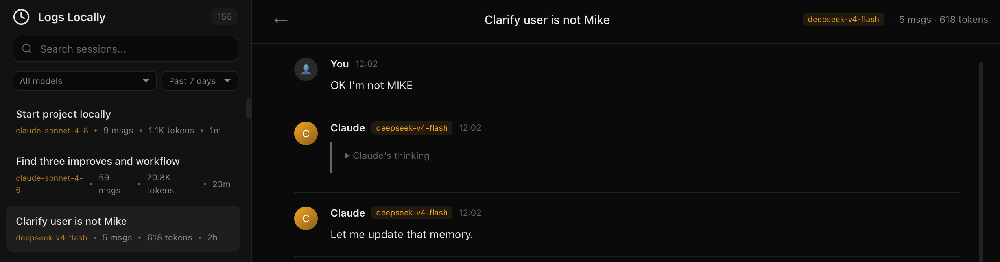

[](https://laotree.github.io/logs-locally-plugin/)
[](LICENSE)

# llp — Local session history for AI coding agents

**Claude Code, Pi agent, and Codex CLI sessions disappear when you close the terminal.** `llp` saves all of them to a local SQLite database and gives you a searchable web UI — automatically, after every session.

**[Homepage](https://laotree.github.io/logs-locally-plugin/) &middot; [Installation](#installation) &middot; [GitHub](https://github.com/Laotree/logs-locally-plugin)**

```bash
# Install (macOS / Linux)
brew tap Laotree/tap && brew install llp

# Save your latest session right now
llp import

# Browse all sessions at http://127.0.0.1:8484
llp serve
```

Then add one line to `~/.claude/settings.json` so it runs automatically on every session exit:

```json
{
  "hooks": {
    "Stop": [{ "hooks": [{ "type": "command", "command": "llp import" }] }]
  }
}
```

That's it. No daemon, no cloud, no API key.

---

> **What is "plugin"?** The name reflects that `llp` integrates with Claude Code's `Stop` hook — but it's a plain CLI binary. No marketplace or plugin runtime required. Install with Homebrew or `cargo install` and it works.



### What you get

- **Full session history** — every Claude Code, Pi agent, and Codex CLI session stored in SQLite
- **Searchable web UI** — filter by model, time, keyword, or quality score
- **Automatic quality scoring** — 7 dimensions (security, efficiency, planning…) with letter grades
- **Privacy-first** — API keys, tokens, and email addresses are scrubbed before storage; nothing leaves your machine
- **GitHub profile chart** — embed a live activity heatmap in your profile README (`llp push`)

## How It Works

Each time Claude Code exits, the `Stop` hook triggers `llp import`, which:

1. Finds the most recent `.jsonl` session file in `~/.claude/projects/<project>/`
2. Parses messages, models, token usage, and session metadata
3. Upserts into a local SQLite database (deduplicated by session ID)
4. Also imports the latest **Pi agent** session for the same project (if `piJsonlDir` is configured)
5. Also imports the latest **Codex CLI** session (if `codexSessionsDir` is configured)
5. Scores each session across 7 quality dimensions (security, effectivity, solidity, efficiency, planning, recovery, accuracy)
6. Scrubs sensitive data (API keys, tokens, credentials, home paths, emails) before storage

The `serve` command starts a web UI at `http://127.0.0.1:8484` for browsing and searching sessions.

## Installation

### Option 1: Homebrew (recommended)

```bash
brew tap Laotree/tap
brew install llp
```

### Option 2: Install from source

```bash
cargo install --git https://github.com/Laotree/logs-locally-plugin
```

### Option 3: Build locally

```bash
cargo build --release
cp target/release/llp ~/.local/bin/llp
```

> Make sure `~/.local/bin` is in your `PATH`.

## Configuration

### Claude Code Hook (auto-import on exit)

```bash
mkdir -p ~/.claude
```

Add to `~/.claude/settings.json`:

```json
{
  "hooks": {
    "Stop": [
      {
        "hooks": [
          {
            "type": "command",
            "command": "llp import"
          }
        ]
      }
    ]
  }
}
```

### Optional: config.json

Create `config.json` in the working directory or pass a custom path with `llp --config <path>`:

```json
{
  "db_path": "~/.local/share/logs-locally-plugin/logs.db",
  "db_paths": [
    "~/.local/share/logs-locally-plugin/logs.db",
    "~/path/to/secondary/logs.db"
  ],
  "claude_projects_dir": "~/.claude/projects",
  "piJsonlDir": "~/.pi/agent/sessions",
  "codexSessionsDir": "~/.codex/sessions",
  "host": "127.0.0.1",
  "port": 8484
}
```

All fields are optional — defaults are shown above.

| Field | Description | Default |
|-------|-------------|---------|
| `db_path` | Primary SQLite database path | `~/.local/share/logs-locally-plugin/logs.db` |
| `db_paths` | Multiple DB paths (import writes to all, serve reads the first) | falls back to `db_path` |
| `claude_projects_dir` | Claude Code sessions directory | `~/.claude/projects` |
| `piJsonlDir` | Pi agent sessions directory (optional — omit to skip pi imports) | none |
| `codexSessionsDir` | Codex CLI sessions directory (optional — omit to skip codex imports) | none |
| `host` | Web server bind address | `127.0.0.1` |
| `port` | Web server port | `8484` |

## Usage

### Import the latest session

```bash
cd /path/to/your/project
llp import
```

This auto-detects the Claude Code project from the current working directory and imports the most recent session (Claude Code, Pi agent, and Codex CLI if configured).

You can also import a specific JSONL file:

```bash
llp import /path/to/specific/session.jsonl
```

### Import all historical sessions

```bash
llp import-all /path/to/your/project
```

Imports every past session (Claude, Pi, and Codex) for the given project directory.

### Browse logs

```bash
llp serve
# Open http://127.0.0.1:8484
```

```bash
llp serve --port 9090   # override port
```

Features:
- Session list with search and filters (by model, source, time range, keyword)
- Message detail view with thinking blocks and tool calls
- Session scoring (7 quality dimensions with letter grades S/A/B/C/D/F)
- **Multi-agent support** — browse Claude Code, Pi agent, and Codex CLI sessions in one UI
- Live auto-refresh (10s polling)
- Statistics dashboard (token usage by model, score aggregates)
- Dark theme, Claude web-inspired design

### Re-score sessions

```bash
llp rescore
```

Re-evaluates session quality scores. Useful after upgrading from a version that didn't include session scoring. Trivial sessions (single commands, empty exchanges) are marked N/A.

### Command reference

```
Usage: llp [OPTIONS] <COMMAND>

Commands:
  import       Import the latest Claude Code, Pi, or Codex session into SQLite
  serve        Start the local web server for browsing logs
  import-all   Import all existing sessions from a project
  rescore      Re-score all sessions in the database
  push         Push daily activity heatmap to relay (default: https://llp.qingyuejiaju.cn)
  relay        Start the multi-user relay server (operator use)
  help         Print help

Options:
  -c, --config <FILE>  Path to config file [default: config.json]
  -h, --help           Print help
```

## GitHub Profile Chart

Embed a live token/session heatmap in your GitHub profile README — two contribution-style grids (sessions 🟠 and tokens 🔵), no raw session content ever leaves your machine.

`llp push` renders the SVG **locally** from your DB aggregates and uploads only the final image. No session titles, messages, or raw content are transmitted.

---

### Option A — Use the official relay (easiest)

The official relay accepts pushes from any `llp` user and stores each user's chart anonymously on a shared Cloudflare Worker.  
Your chart URL is derived from a SHA-256 hash of your identity — it cannot be guessed.

**1. Push (no config needed)**

```bash
llp push
```

That's it. `llp push` defaults to `https://llp.qingyuejiaju.cn`. No `pushToken`, no `pushUrl`, no config file required.

On first run `llp push` will ask whether you want a daily cron job at 09:00 — press `y` to install it automatically.

You'll receive a chart URL like:

```
https://llp-chart.laotree.workers.dev/chart/<16-char-hash>.svg
```

**2. Optional: set a push identity**

If you want a stable chart URL across machines, set a token:

```bash
export LLP_PUSH_TOKEN=<your-secret-token>
llp push
```

Or in `config.json`:

```json
{
  "pushToken": "<your-secret-token>",
  "pushUser":  "<your-display-name>"
}
```

> `pushUser` is a display label only. `pushToken` is the privacy key — pick something long and random (e.g. `openssl rand -hex 32`). Without a token, the relay uses your hostname or `"anonymous"` as the identity.

**3. Add to your GitHub profile README**

```markdown

```

---

### Option B — Self-hosted Worker (full control)

Deploy your own Cloudflare Worker (free tier, ~40 lines of JS, no build step):

```bash
cd workers
npm install
npx wrangler login

# Create a KV namespace and paste the returned id into wrangler.toml
npx wrangler kv namespace create CHART
# Edit workers/wrangler.toml: replace REPLACE_WITH_YOUR_KV_NAMESPACE_ID

# Set the shared secret (must match pushToken in config.json)
npx wrangler secret put PUSH_TOKEN

npx wrangler deploy
```

Then configure `config.json`:

```json
{
  "pushToken": "<same secret you set above>",
  "pushUrl":   "https://llp-chart.<your-subdomain>.workers.dev"
}
```

Push with `llp push` — chart is at `https://llp-chart.<your-subdomain>.workers.dev/chart.svg`.

---

### Option C — Self-hosted relay (run your own relay server)

You can run your own relay with Docker and point it at any Cloudflare Worker:

**With `docker compose`:**

```yaml
services:
  relay:
    image: ghcr.io/laotree/logs-locally-plugin:latest
    restart: unless-stopped
    environment:
      MODE: relay
      LLP_CF_WORKER_URL: https://llp-chart.<your-subdomain>.workers.dev
      LLP_CF_PUSH_TOKEN: <cf-worker-push-token>
    ports:
      - "8485:8485"
```

**Or with `docker run`:**

```bash
docker run -d \
  -e MODE=relay \
  -e LLP_CF_WORKER_URL=https://llp-chart.<your-subdomain>.workers.dev \
  -e LLP_CF_PUSH_TOKEN=<cf-worker-push-token> \
  -p 8485:8485 \
  ghcr.io/laotree/logs-locally-plugin:latest
```

The relay is stateless — it accepts pushes with or without a token. When no Bearer token is provided, it uses the `user` field from the push payload as the identity. It forwards only `{hash, svg}` to the CF Worker.

**Environment variables for the relay:**

| Variable | Required | Description |
|----------|----------|-------------|
| `LLP_CF_WORKER_URL` | ✅ | Target Cloudflare Worker URL |
| `LLP_CF_PUSH_TOKEN` | ✅ | Bearer token for the CF Worker's `/api/push` |
| `LLP_MAX_PUSHES_PER_HOUR` | optional | Per-user rate limit (default: 5) |

---

### Auto-push on session end

Add to your `Stop` hook to push automatically after every Claude session:

```json
{
  "hooks": {
    "Stop": [
      { "hooks": [{ "type": "command", "command": "llp import && llp push --no-schedule" }] }
    ]
  }
}
```

---

## Build

```bash
# Build the release binary
cargo build --release

# Install to ~/.local/bin
cp target/release/llp ~/.local/bin/llp

# Or install from source in one step
cargo install --git https://github.com/Laotree/logs-locally-plugin
```

### Makefile targets

```bash
make build    # cargo build
make release  # cargo build --release
make install  # build release + copy to ~/.local/bin + install hooks
make test     # cargo test
make serve    # cargo run -- serve
make import   # cargo run -- import
make rescore  # cargo run -- rescore
make fmt      # cargo fmt
make lint     # cargo clippy
make clean    # cargo clean
```

## Database

Sessions and messages are stored in a SQLite database at `~/.local/share/logs-locally-plugin/logs.db` (configurable). Imports can write to multiple DBs simultaneously (`db_paths` config).

```sql
-- Sessions table
CREATE TABLE sessions (
    id TEXT PRIMARY KEY,
    title TEXT,
    model TEXT,
    created_at TEXT NOT NULL,
    updated_at TEXT NOT NULL,
    message_count INTEGER DEFAULT 0,
    token_count INTEGER DEFAULT 0,
    cwd TEXT,
    git_branch TEXT,
    version TEXT,
    source TEXT NOT NULL DEFAULT 'claude'   -- 'claude' | 'pi' | 'codex'
);

-- Messages table
CREATE TABLE messages (
    id TEXT PRIMARY KEY,
    session_id TEXT NOT NULL REFERENCES sessions(id),
    role TEXT NOT NULL,
    content TEXT NOT NULL,
    created_at TEXT NOT NULL,
    token_count INTEGER DEFAULT 0,
    parent_id TEXT,
    model TEXT
);

-- Scoring table (auto-scored on import)
CREATE TABLE scores (
    session_id TEXT PRIMARY KEY REFERENCES sessions(id),
    total_score INTEGER NOT NULL,
    security INTEGER NOT NULL,
    effectivity INTEGER NOT NULL,
    solidity INTEGER NOT NULL,
    efficiency INTEGER NOT NULL,
    planning_quality INTEGER NOT NULL,
    recovery_ability INTEGER NOT NULL,
    hallucination_rate INTEGER NOT NULL,
    grade TEXT NOT NULL,            -- S/A/B/C/D/F
    scored_at TEXT NOT NULL
);
```

### Scoring dimensions

Each session is scored on 7 dimensions (max 100 total):

| Dimension | Max | What it measures |
|-----------|-----|------------------|
| Security | 15 | Dangerous commands (rm -rf, pipe-to-shell, etc.) |
| Effectivity | 15 | Completion rate, failure vs. success signals |
| Solidity | 10 | Test coverage: test execution > test references > code generation |
| Efficiency | 15 | Correction loops, token bloat, short clean sessions |
| Planning | 15 | Structured plans, numbered steps, sequential thinking |
| Recovery | 15 | Error handling, self-correction rate |
| Accuracy | 15 | User satisfaction vs. corrections and confusion |

Trivial sessions (single commands, empty exchanges) are marked N/A instead of scored.

### Security & privacy

Before storage, all content is scrubbed for sensitive data:
- API keys (Anthropic, OpenAI, GitHub, AWS)
- Bearer tokens and credentials in URLs
- Environment variable secrets (names ending in KEY/SECRET/TOKEN/PASSWORD)
- Home directory paths (`/Users/name` → `~`)
- Email addresses

## Improving discoverability (manual steps)

A few things that can't be automated — worth doing once:

**GitHub topics** — go to your repo → About (gear icon) → Topics, add:

```
claude-code  rust  cli  sqlite  developer-tools  llm  session-logging  ai-tools
```

**Demo GIF** — record a 10-second terminal session (`asciinema` or QuickTime) showing `llp import && llp serve`. Drop it in `docs/` and embed it near the top of this README.

**Post it once** — a short post on [r/ClaudeAI](https://www.reddit.com/r/ClaudeAI/) or [Dev.to](https://dev.to/) with the framing: "I got tired of losing my Claude Code sessions — built a local history tool." One post, no spam.
